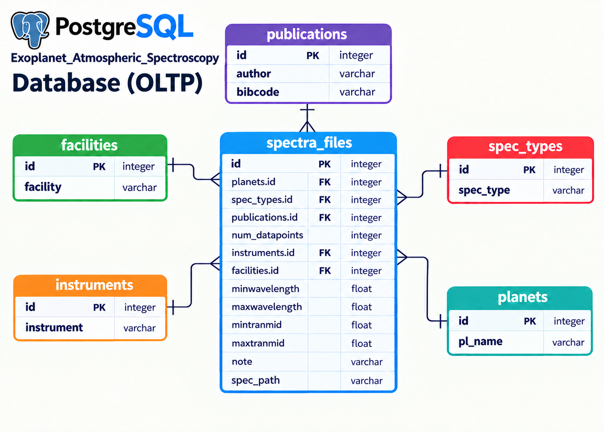
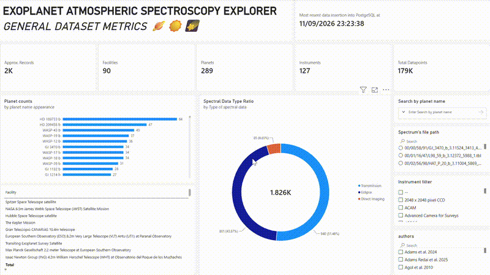

# 🪐 Exoplanet Atmospheric Spectroscopy Data Pipeline 

This project is an end-to-end data engineering pipeline that extracts exoplanet atmospheric spectroscopy data from the **NASA Exoplanet Archive TAP service**, transforms and normalises the data using Python, Pandas and SQLAlchemy, then loads it into structured **PostgreSQL databases**.  A Power BI dashboard is then created using the database data to provide an easy analytical experience, displaying key metrics from the dataset.

The pipeline separates the data into lookup/dimension tables and a central fact table, maintaining important relationships through foreign keys. Two databases are supported: a **live database** for more recent data and an **archive database** for older data. This **archive database** can also function as a redundancy measure.


## Project Overview

* **Pipeline scope:** Complete ETL pipeline from the NASA Exoplanet Archive to PostgreSQL
* **Data extraction:** Retrieves spectroscopy data through the NASA TAP API
* **Data modelling:** Designed a normalised relational schema containing lookup/dimension tables and a fact table
* **ETL development:** Implemented extract, transform and load processes using Python, Pandas and SQLAlchemy
* **Data integrity:** Uses primary keys, unique constraints and foreign keys to maintain relationships between tables
* **Database environments:** Supports separate live and archive PostgreSQL databases
* **Validation:** Includes HTTP status checks, record counts and pipeline progress messages
* **Automation:** Uses a master orchestration script to execute the pipeline stages in sequence
* **Analytics:** Creates a meaningful Power BI dashboard for clear analysis.


---

# 🧩 Problem & Context

**Problem:** Exoplanet spectroscopy data on NASA's archive site can be difficult to **interpret** for those who simply want a general understanding of the dataset and some key metrics about it. The raw API data fetched contains repeated information such as planet names, instruments, facilities, publication details and spectroscopy types.

For third parties interested in storing this information, a dataset containing repeating data in one large flat table can create unnecessary duplication and make maintaining relationships between records more difficult.

**Solution:** I developed an ETL pipeline to retrieve spectroscopy records from the NASA Exoplanet Archive as a CSV file, transform the raw data, separate repeated attributes into lookup/dimension tables, and load the resulting data into a normalised PostgreSQL database. Then, use the database's data to create an interactive Power BI dashboard, providing an easy analytical experience and displaying key metrics from the dataset.


The pipeline creates a central `spectra_files` fact table and connects it to related lookup tables using foreign keys.

**Relevant code:** 

* [`orchestrate_func.py`](nasa-etl-data-pipeline/orchestrate_func.py) - Master pipeline orchestration
* [`first_api_call_df_creation.py`](/nasa-etl-data-pipeline/first_api_call_df_creation.py) - NASA API/TAP extraction
* [`second_create_pg_tables.py`](nasa-etl-data-pipeline/second_create_pg_tables.py) - PostgreSQL schema creation
* [`third_load_dim_tables.py`](nasa-etl-data-pipeline/third_load_dim_tables.py) - Lookup table loading
* [`fourth_load_fact_table.py`](nasa-etl-data-pipeline/fourth_load_fact_table.py) - Fact table loading

---

# 🛠️ Tech Stack Used

* 🪐 **Data Source:** NASA Exoplanet Archive TAP service
* 🐍 **Languages:** Python, SQL
* 🐼 **Data Processing:** Pandas
* 🐘 **Database:** PostgreSQL
* 🔌 **Database Connectivity:** SQLAlchemy
* 🌐 **API Requests:** Python Requests
* 📄 **Environment Configuration:** Python-dotenv
* 🛠️ **Development:** VS Code + Terminal 
* 📊 **Analysis / Visualisation:** Power BI
* 📦 **Version Control:** Git/GitHub

---

# 🏗️ Pipeline Architecture

The pipeline extracts data from the NASA Exoplanet Archive TAP service and processes it through three main stages:


## Pipeline Stages and Development

### 🛠️ Exploratory data analysis 

Before pipeline development began, the data was analysed to find key information about the dataset that would aid in the creation of fact/dim tables within PostgreSQL.

Further details on this analysis exist within this document:
[`Data_exploration&Design_justification`](/Data_exploration&Design_justification%20document.ipynb)

### 1. Extract - NASA API/TAP

The first stage sends an HTTP GET request to the NASA Exoplanet Archive API/TAP service.

The SQL query retrieves records from the `spectra` table and requests the results in CSV format.

**Code:** [`first_api_call_df_creation.py`](/nasa-etl-data-pipeline/first_api_call_df_creation.py)

The API request is implemented through the `nasa_get()` function in [`orchestrate_func.py`](nasa-etl-data-pipeline/orchestrate_func.py).

```python
def nasa_get():
```

The returned HTTP response is passed to the orchestration script, where the CSV response is converted into a Pandas DataFrame.

---

### 2. Create PostgreSQL Tables

The second stage creates the PostgreSQL database schema using SQL DDL.

**Code:** [`second_create_pg_tables.py`](nasa-etl-data-pipeline/second_create_pg_tables.py)

The following tables are created:

* `planets`
* `instruments`
* `publications`
* `facilities`
* `spec_types`
* `spectra_files`

The lookup tables use generated identity columns as primary keys, while unique constraints are used to prevent duplicate values from being inserted.

The `spectra_files` table acts as the central fact table and contains foreign keys connecting it to the lookup tables.

---

### 3. Load Lookup / Dimension Tables

The third stage loads the lookup data extracted from the NASA API into PostgreSQL.

**Code:** [`third_load_dim_tables.py`](nasa-etl-data-pipeline/third_load_dim_tables.py) 

The script contains functions for loading:

* Planet names
* Instruments
* Spectroscopy types
* Facilities
* Publications

`NULL` values are removed and unique values are extracted before insertion.

For example:

```python
planets = list(
    spectra_dataframe["pl_name"].dropna().unique()
)
```

This reduces duplication in the database and allows the fact table to reference each lookup value through an ID.

---

### 4. Loading the Fact Table

The fourth stage loads the spectroscopy records into the `spectra_files` table.

**Code:** [`fourth_load_fact_table.py`](nasa-etl-data-pipeline/fourth_load_fact_table.py)

The script first retrieves the lookup tables from PostgreSQL as DataFrames:

```python
planets_df = pd.read_sql("SELECT * FROM planets;", conn)
publications_df = pd.read_sql("SELECT * FROM publications;", conn)
spec_types_df = pd.read_sql("SELECT * FROM spec_types;", conn)
facilities_df = pd.read_sql("SELECT * FROM facilities;", conn)
instruments_df = pd.read_sql("SELECT * FROM instruments;", conn)
```

Each NASA record is then matched against the appropriate lookup table to obtain its corresponding ID.

```python
pub_id = publications_df.loc[(publications_df["authors"] == record_publication["authors"]) & (publications_df["bibcode"] == record_publication["bibcode"])]["id"].values
            if len(pub_id) == 0:
                publication_id = None
            else:
                publication_id = int(pub_id[0])
```
If a non-key column has a NULL value, the function simply sets its value to NULL in the database.


# 🗂️ Database Schema

The database uses a normalised relational structure.



**Schema code:** [`second_create_pg_tables.py`](nasa-etl-data-pipeline/second_create_pg_tables.py)


# 🔎 Lookup & ID Matching

Once the dimension tables have been populated, the fact-table pipeline retrieves their IDs.

**Code:** [`fourth_load_fact_table.py`](nasa-etl-data-pipeline/fourth_load_fact_table.py)

For example, the planet name from a NASA record is matched against the `planets` DataFrame:

```python
pl_id = planets_df.loc[
    planets_df["pl_name"] == record_planet
]["id"].values
```

If a matching ID exists, it is converted into an integer and assigned to the foreign-key field.

If no match is found, the value is set to `None`.

The same approach is used for:

* Planets
* Spectroscopy types
* Publications
* Instruments
* Facilities


# ⏱️ Timestamp Tracking

The `spectra_files` table includes an `inserted_at` field.

**Code:** [`second_create_pg_tables.py`](nasa-etl-data-pipeline/second_create_pg_tables.py)

```sql
inserted_at TIMESTAMP DEFAULT CURRENT_TIMESTAMP
```

This allows PostgreSQL to automatically record the timestamp associated with a newly inserted record.

The timestamp is generated by PostgreSQL using `CURRENT_TIMESTAMP`.


# ⚙️ Pipeline Orchestration

The complete ETL process is controlled by the master orchestration script.

**Code:** [`orchestrate_func.py`](nasa-etl-data-pipeline/orchestrate_func.py)

The `run_pipeline()` function executes the pipeline stages sequentially:

```text
Step 1
NASA API/TAP request
        │
        ▼
Step 2
Create PostgreSQL tables
        │
        ▼
Step 3
Load lookup tables
        │
        ▼
Step 4
Load spectra_files fact table
```


# 🟢 Live Database Pipeline

The live database pipeline runs the complete ETL process against the PostgreSQL live database.

**Code:** [`nasa_to_livedb.py`](nasa-etl-data-pipeline/nasa_to_livedb.py)

The database connection is retrieved from an environment variable:

```text
LIVE_DATABASE_URL
```

The pipeline is then executed using:

```python
run_pipeline(exodb_url)
```

The script also prints a timestamp after the pipeline has completed.

The live database pipeline is intended to be run **more frequently** than the archive pipeline because it is intended for more recent data.


# 📦 Archive Database Pipeline

The archive database pipeline runs the same ETL process against the PostgreSQL archive database.

**Code:** [`nasa_to_archivedb.py`](nasa-etl-data-pipeline\nasa_to_archivedb.py)

The database connection is retrieved from:

```text
ARCHIVE_DATABASE_URL
```

The pipeline is then executed using the same master `run_pipeline()` function.

The archive pipeline is intended to be run **less frequently** than the live database pipeline and is intended for older data.

## HTTP Error Handling

The orchestration script checks the NASA API response using:

```python
response.raise_for_status()
```

It also outputs the HTTP status code for validation.

**Code:** [`orchestrate_func.py`](nasa-etl-data-pipeline/orchestrate_func.py)


## Record Validation

After loading the fact table, the pipeline performs a record count:

```sql
SELECT COUNT(*) AS number_of_records
FROM spectra_files;
```

The resulting number of records is returned as part of the pipeline validation message.

**Code:** [`fourth_load_fact_table.py`](nasa-etl-data-pipeline/fourth_load_fact_table.py)


# 📊 BI & Analytical Use

The PostgreSQL database can be connected to analytical and visualisation tools such as:

* 📊 Power BI
* 📈 Tableau
* 🐍 Python / Pandas

The normalised database structure provides a structured source for querying exoplanet spectroscopy data and building analytical dashboards.

Using semantic modelling, DAX, and visuals, an interactive dashboard was created to enable end users to easily explore and analyse the dataset.
 
 

# ⚙️🛠️ Data Engineering Skills Demonstrated

### ETL Pipeline Development

* **Extract:** Retrieve spectroscopy data from the NASA Exoplanet Archive TAP/API
* **Transform:** Clean, deduplicate and type-convert data using Pandas
* **Load:** Insert transformed data into PostgreSQL
* **Orchestration:** Execute multiple ETL stages sequentially
* **Validation:** HTTP status checks and database record counts
* **Pipeline separation:** Separate live and archive database pipelines


### Database Design

* Normalised relational schema
* Fact and lookup tables
* Primary keys
* Foreign keys
* Unique constraints
* Composite uniqueness for publications
* Timestamp tracking
* Referential integrity

### Python & SQL

* Python functions for reusable pipeline stages
* Pandas DataFrames for transformation
* SQLAlchemy for PostgreSQL connections
* Parameterised SQL queries
* SQL DDL for database schema creation
* SQL DML for data insertion
* Data type conversion
* Lookup-table ID matching


### Production Practices

* Environment variables for database configuration
* Separate live and archive database environments
* Modular pipeline architecture
* Clear pipeline progress messages
* HTTP error handling
* Record-count validation
* Foreign-key based data integrity
* Timestamp tracking


# 🎯 Project Outcomes

The completed pipeline provides a structured data engineering workflow for transforming raw exoplanet spectroscopy data from the NASA Exoplanet Archive into a normalised PostgreSQL database.

The resulting system provides:

* A repeatable ETL workflow
* Structured relational data
* Reduced data duplication
* Foreign-key relationships between entities
* Separate live and archive environments
* API validation
* Database record validation
* Timestamp tracking
* A PostgreSQL data source suitable for downstream analysis and BI dashboards


# ⛔ Project Limitations

* **Cloud**: It is possible to connect to a cloud service and run this script with the appropriate database connections. However, for the scope of this project, a local PostgreSQL database works fine.


