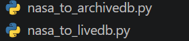

## 🛠️ Pipeline execution

To run the data pipeline, at least one archive or live database must be created in PostgreSQL (the databases do not need to be named exactly that). The archive and live scripts act as orchestration scripts and execute the individual pipeline stages.

### Archive script

This file runs the pipeline from NASA's API/TAP to the PostgreSQL archive database. Ideally, this should be run LESS frequently than the live database pipeline,
which is intended for more recent data.

### Live script

This file runs the pipeline from NASA's API/TAP to the PostgreSQL live database. Ideally, this should be run MORE frequently than the archive database pipeline,
which is intended for older data.

### Pipeline

The diagram above illustrates the data pipeline.